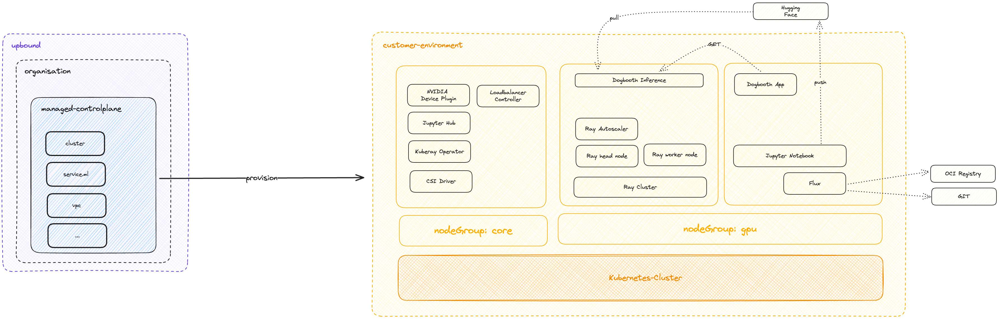
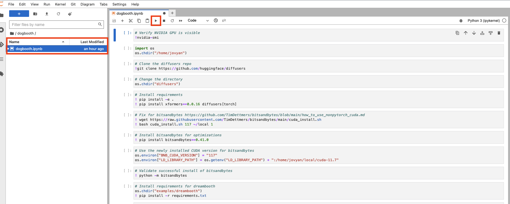

# configuration-caas-ml

Configuration-caas-ml is a setup for deploying the Stable Diffusion Model using Cluster-as-a-Service in Upbound.
Several tools are available to create and operate models, including those within Kubernetes.
One promising setup combines Upbound, Flux, JupyterHub, Ray, and Kubernetes.

## Architecture

*Upbound*
is the easiest place to build, deploy, and manage cloud platforms using control planes. Many organizations find themselves embarking on similar journeys; Whether it's building “golden paths”, “launch zones”, or “cloud infrastructure self-service”, organizations are beginning to build their own internal developer platforms above the clouds–and they’re using control planes to power them. With Upbound's managed control planes your organization can operate control planes at scale.

*Flux*
is an open-source tool that automates the deployment and continuous synchronization of applications and configuration across Kubernetes clusters. It helps ensure that your Kubernetes-based applications are always up to date with the desired state defined in your version control system.

*JupytherHub*
provides a shared platform for running notebooks that are popular in business, education, and research. It promotes interactive computing where users can execute code, visualize results, and work together. In the realm of GenAI, JupyterHub accelerates the experimentation process, especially in the feedback loop. It’s also where Data Engineers collaborate on models for Prompt Engineering.

*Ray*
is an open-source distributed computing framework that makes it easy to scale applications and to use state-of-the-art machine learning libraries. Ray is used to distribute the training of generative models across multiple nodes, which accelerates the training process and allows for the handling of larger datasets.

*Kubernetes*
is a powerful container orchestration platform that automates the deployment, scaling, and management of containerized applications. Kubernetes provides the infrastructure to run and scale GenAI models in containers, which ensures high availability, fault tolerance, and efficient resource utilization.

## Solution Architecture



## Run
Step-by-Step guide on how tp deploy a generative model with Upbound on Kubernetes

### Steps to deploy Stable Diffusion Model on Kubernetes
#### Pre-requisites

* Upbound Organization
* Upbound Managed Control Plane (MCP)
* kubectl
* HuggingFaceToken with `write-scope`

Step 1:
Utilize this setup within an Upbound Managed Control Plane.

Step 2: 
First, we need to set up a Kubernetes cluster.

```bash
kubectl apply -f ./up/examples/cluster.yaml
```

Afterward, we need to configure our Kubernetes services, including Kubernetes add-ons and the necessary tools for machine learning.
Note: Please insert your own token into the Kubernetes secret.

```bash
kubectl apply -f ./up/examples/secret-hf-token.yaml
kubectl apply -f ./up/examples/secret-notebook.yaml
kubectl apply -f ./up/examples/ml.yaml
```

This configuration provisions the following:
* VPC
* Subnets
* Internet-Gateway
* EKS Cluster
* EKS managed node group for core components
* EKS managed node group for gpu components
* Amazon EBS CSI Driver
* AWS Loadbalancer Controller
* NVIDIA Device Plugin
* JupyterHub
* Ingress Nginx
* Kuberay-Operator

Step 3:
Fine-Tune Stable Diffusion Model

You are now prepared to begin experimenting with our model and create a notebook to customize it according to your requirements. Retrieve the Load Balancer DNS:

```bash
kubectl get svc proxy-public -n jupyterhub --output jsonpath='{.status.loadBalancer.ingress[0].hostname}'
```

Open the provided DNS hostname (e.g., k8s-jupyterh-proxypub-xxx.elb.eu-central-1.amazonaws.com) in your web browser.

Log in using the username "admin1" and the password found in the managed resource called `jupyterChart`.

This action initiates the provisioning of a pod named `jupyter-admin1` on the g5.12xlarge instance. You can observe this pod by running the command "kubectl get pods -n jupyterhub.

```bash
kubectl get pods -n jupyterhub
NAME                            READY   STATUS    RESTARTS   AGE
continuous-image-puller-kbvwc   1/1     Running   0          1h
continuous-image-puller-lftzx   1/1     Running   0          1h
continuous-image-puller-mst4w   1/1     Running   0          1h
continuous-image-puller-t9wfg   1/1     Running   0          1h
hub-5f4d644989-49lz2            1/1     Running   0          1h
jupyter-admin1                  1/1     Running   0          1h
proxy-5f89cffc9c-92qgz          1/1     Running   0          1h
```

After a successful launch, you will be automatically redirected to the notebook console in your web browser. Begin running the given Python notebook found in the `dogbooth` directory using the file browser interface in the notebook UI, as depicted in the following illustration.



This takes about an 1.5 hours to complete.

Step 4: 
Serving the Large Language Model

Once applied, the RayCluster's head node and worker node will be scheduled on the GPU nodes, and the inference endpoint will be accessible through the load balancer's DNS hostname. Please note that due to the large image size of the GPU-based `rayproject/ray-ml:2.6.0-gpu` base image, this process may take up to eight minutes.

To monitor the pods and wait for them to be up, use the command `kubectl get pods -n dogbooth --watch`. Once they are ready, obtain the load balancer's DNS hostname and access the Ray Dashboard in your web browser.

```bash
kubectl get ingress dogbooth -n dogbooth --output jsonpath='{.status.loadBalancer.ingress[0].hostname}'
```

Lastly, confirm the deployment of our Dogbooth model using a prompt like this:

```bash
http://k8s-ingressn-ingressn-xxx.elb.eu-central-1.amazonaws.com/dogbooth/serve/imagine?prompt=a photo of [v]dog on the sun
```


